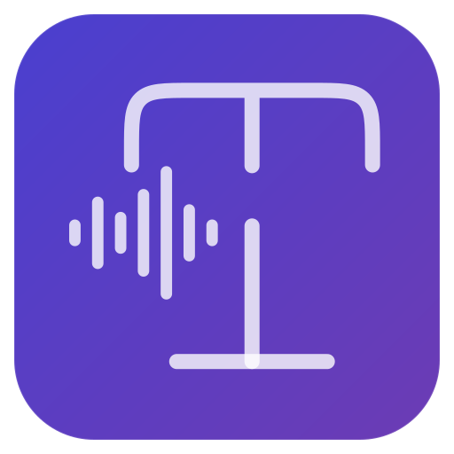
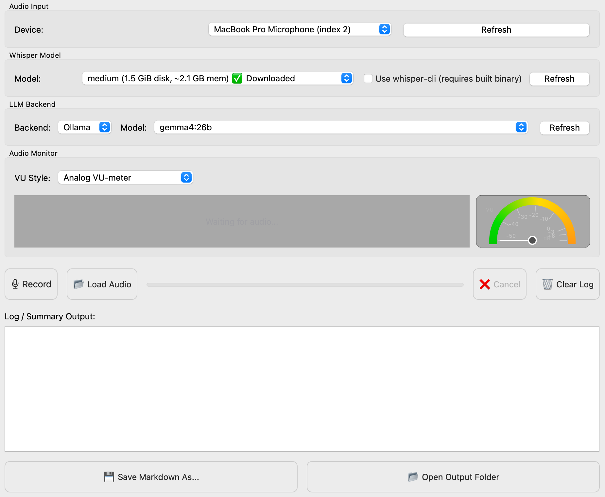
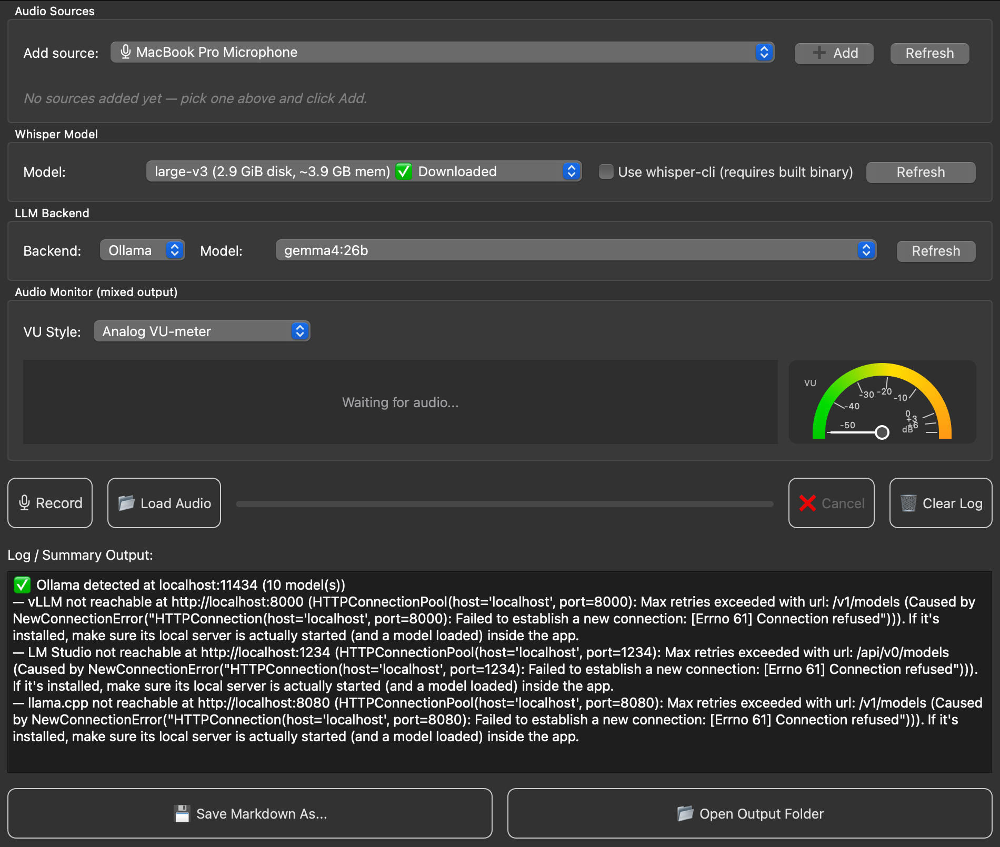

<p align="center">
  
</p>

<h1 align="center">Meeting Transcriber</h1>

<p align="center">
A beautiful native Linux desktop client for Ollama.
</p>

<p align="center">


</p>

A cross‑platform desktop application built with PyQt5 that records **one or more audio sources at once** (microphone, MS Teams / system audio, a second mic, …), mixes them live into a single stream, transcribes it with Whisper, and generates a structured summary using a local large language model (LLM). All files are saved in timestamped folders under `./transcripts/`.

| Light Theme | Dark Theme |
|------------|------------|
|  |  |
| Main application window using the light theme. | Main application window using the dark theme. |

> The screenshots above predate the multi-source Audio Sources panel described below — the rest of the window is unchanged.

Table of Contents
1. [Features](#Features)
2. [Project Structure](#Project-Structure)
3. [Audio Sources & the Mixer Engine](#Audio-Sources--the-Mixer-Engine)
4. [System Requirements](#System-Requirements)
5. [Installation](#Installation)
5. [Create StandAlone Executable](#Create-Standalone-Executable)
6. [Whisper Backend](#Whisper-Backend)
7. [LLM Backend](#LLM-Backend)
8. [Configuration](#Configuration)
9. [Usage](#Usage)
10. [Recording](#Recording)
11. [Loading an Existing Audio File](#Loading-an-Existing-Audio-File)
12. [Selecting Models](#Selecting-Models)
13. [Processing](#Processing)
14. [Viewing Output](#Viewing-Output)
15. [File Output Structure](#FileOutput-Structure)
16. [Troubleshooting](#Troubleshooting)
17. [License](#License)

# Features
* 🎛️ **Multi-source Audio Mixer Engine** – record your microphone and system/Teams audio (loopback) at the same time, mixed live into one stream. Add as many sources as you like; each gets its own gain slider, mute button, and VU meter.
* 🎤 Live recording with a real‑time **mixed** VU meter and scrolling waveform display.
* 📂 Load audio files in common formats (WAV, MP3, M4A, FLAC, OGG, AAC).
* 🗣️ Transcription using either:
    * faster‑whisper (Python, recommended) – automatically used if installed, loads from the local cache first so repeat runs need no network access.
    * whisper‑cli from whisper.cpp (C++ implementation) – lower resource usage, never touches the network after the initial model download.
* 🧠 **Adaptive default Whisper model** – automatically pre-selects the best model you already have downloaded (see [Whisper Backend](#Whisper-Backend) for the priority order), instead of always defaulting to a fixed size.
* 🤖 Summarization via local LLM servers supporting:
    * Ollama
    * vLLM
    * LM Studio *(only models actually loaded into memory are offered — see below)*
    * llama.cpp (OpenAI‑compatible endpoint)
    * and more ….
* 🔍 **Backend detection diagnostics** – hit Refresh next to the LLM Backend dropdown and the log tells you exactly which servers were found and why any weren't (wrong port, server not started, etc.) instead of a silent empty dropdown.
* 📝 Streaming summary displayed in real time as the LLM generates it.
* 📁 Organised output: every job creates a separate folder with the audio, transcript, and a Markdown summary.
* 💾 Save/export the summary Markdown file.
* 📂 Open output folder with one click.
* 🔄 Job queue – process multiple audio files sequentially without blocking the UI.

# Project Structure
The app is split into focused modules instead of one large file:

```text
main.py                   MainWindow, all UI wiring, application entry point
├── audio_engine.py       Multi-source capture + live mixing (AudioSource, AudioMixerEngine)
├── vu_meters.py          Waveform display + 14 VU-meter visual styles
├── whisper_engine.py     Model catalogue, download, offline-first transcription
├── llm_backend.py        Ollama / vLLM / LM Studio / llama.cpp detection + summarization
└── pipeline.py           Job queue: Job, ProcessingWorker, QueueWorker
```

Each file can be read (and modified) on its own — `audio_engine.py` doesn't know anything about Qt widgets, `vu_meters.py` doesn't know anything about audio capture, etc.

# Audio Sources & the Mixer Engine

## How the mix works
Every source you add (microphone, system-audio loopback, a second mic…) runs its own capture stream, gets downmixed to mono and resampled to 16 kHz, then all active, unmuted sources are summed together roughly 30 times a second into one continuous recording:

```text
 🎤 Microphone      ──┐
                      │     gain         mute?       resample
 💻 Teams (loopback) ─┼─▶ [ x1.3 ]─▶[skip if muted]─▶[→16kHz]──┐
                      │                                        │
 🎤 USB Mic 2       ──┘                                        ├─▶  SUM  ─▶ clip[-1,1] ─▶ meeting.wav
                                                               │                 │
                                                     per-source VU meters    combined waveform + VU meter
```

Sources are mixed independently of how fast each device's driver delivers audio — the engine pads whichever source produced less audio in a given tick with silence so everything stays aligned, rather than the whole mix stalling on the slowest device.

## The Audio Sources panel
```text
┌─ Audio Sources ───────────────────────────────────────────────────────────┐
│ Add source: [ 💻 Stereo Mix (loopback)            ▾ ]  [➕ Add] [Refresh] │
│             (already-added devices appear greyed out and unselectable)    │
│                                                                           │
│  🎤 Realtek Mic        Gain [───●───────] 100%   ☐ Mute   █ █ ░░   [✕]    │
│  💻 Teams (loopback)   Gain [──────●────] 130%   ☐ Mute   █ ░░░░   [✕]    │
└───────────────────────────────────────────────────────────────────────────┘
```
* **Add source** lists every microphone plus every detected system-audio device; picking one and clicking **Add** starts it immediately as its own row.
* Each row has an independent **gain** slider (0–200%), a **mute** checkbox, a small live VU meter, and a remove (✕) button.
* A device already in the mix is greyed out in the picker so it can't be added twice; removing it makes it selectable again.
* The waveform and VU meter at the top of the window always reflect the **combined, mixed** output — what actually gets saved and transcribed.

## Capturing system audio (Teams, etc.) per OS
This is the one part of the app that genuinely differs by operating system, because "record what's coming out of the speakers" isn't a single cross-platform API:

| OS | How it works | Setup needed |
|---|---|---|
| **Windows** | WASAPI loopback — captures whatever is being played through an output device. | None. Requires the optional `sounddevice` package (see [Installation](#Installation)); it's the only thing on Windows that isn't handled by the primary audio library. |
| **macOS** | [BlackHole](https://existential.audio/blackhole/) (free virtual audio driver) appears as a normal input device once installed. | Install BlackHole, then route Teams's output to it — directly, or via a Multi-Output Device in *Audio MIDI Setup* if you also want to hear it yourself. |
| **Linux** | Every PulseAudio/PipeWire output (sink) automatically has a matching `.monitor` source. | None — it just shows up in the **Add source** picker (usually named "Monitor of …"). |

# System Requirements
* Operating System: Windows, macOS, or Linux (tested on POP!_OS & Mac OS ARM).
* Python: 3.8 or higher.
* RAM: At least 4 GB (more recommended for larger Whisper models and LLMs).
* Disk Space: Depends on the models used (see Whisper model sizes below).
* Audio Input: A working microphone (for recording) or any audio file for processing.
* No system-level audio library needs to be installed ahead of time on any OS (see [Installation](#Installation)) — the one exception is Windows loopback capture, which needs the optional `sounddevice` package.

# Installation
1. Clone or Download the Source
    ```bash
    git clone https://github.com/glegigan/Transcriber-Summary.git
    cd Transcriber-Summary
    ```

2. Install Python Dependencies

    Install a python virtual environment (optional)

    ```bash
    python3 -m venv venv
    source venv/bin/activate
    ```

    Install dependencies (mandatory)

    ```bash
    pip install -r requirements.txt
    ```

    This installs PyQt5, numpy, [`miniaudio`](https://pypi.org/project/miniaudio/) (audio capture — ships as a self-contained wheel, no system PortAudio/ALSA-dev package needed on any OS), soundfile, and requests.

    If you want to use the faster‑whisper backend (recommended for ease of use), also install:
    ```bash
    pip install faster-whisper
    ```
    > Note: `faster‑whisper` is optional – if not installed, the application will fall back to `whisper‑cli`.

    **Only if you need Windows system-audio (Teams/loopback) capture**, also install:
    ```bash
    pip install sounddevice
    ```
    This is the one capture path `miniaudio`'s Python bindings don't expose (see the [system-audio table](#capturing-system-audio-teams-etc-per-os) above). It's optional — the app runs fine without it if you only ever record your microphone, or if you're on macOS/Linux.

3. Whisper Backend
You have two options – the GUI will let you choose which one to use.

**Option A: faster‑whisper (Python)**
* Advantages: Easy installation, no separate build required. Loads from the local Hugging Face cache first — after a model's first download, transcription needs no network access at all.
* Disadvantages: May use more RAM/CPU than the C++ version.

If you installed faster‑whisper via pip, you are ready to go. Do not check the "Use whisper‑cli" box in the GUI.

**Option B: whisper‑cli (C++ from whisper.cpp)**
* Advantages: Faster on some systems, lower memory footprint, never talks to Hugging Face at all (models come from whisper.cpp's own download script).
* Disadvantages: Requires compilation and manual model download.

**Step‑by‑step setup:**

1. Clone the whisper.cpp repository:

```bash
git clone https://github.com/ggerganov/whisper.cpp.git ~/whisper.cpp
cd ~/whisper.cpp
```

2. Build the project:

```bash
make -j
```

(On Windows, you may need to use CMake or follow the whisper.cpp build instructions.)

3. Download the desired Whisper models using the provided script:

```bash
cd models
./download-ggml-model.sh tiny   # or base, small, medium, large-v3, etc.
```

The models will be placed in `~/whisper.cpp/models/` as `ggml-*.bin` files.

4. The GUI will automatically detect downloaded models and allow you to select them.
Check the "Use whisper‑cli" box in the GUI when you want to use this backend.

> The application can auto‑download models through the GUI, but only if the download script (`~/whisper.cpp/models/download-ggml-model.sh`) exists and is executable. If you built whisper.cpp as above, this script is present.

# LLM Backend
The application does not include an LLM – you must run one separately on your machine. Supported backends:

* Ollama (default port 11434)
* vLLM (port 8000)
* LM Studio (port 1234) — **only models actually loaded into memory are selectable.** LM Studio can have several models downloaded but only serves the one(s) you've explicitly loaded in the app; the Model dropdown greys out everything else (labeled "not loaded") rather than letting you pick a model that will just fail.
* llama.cpp (port 8080)

Example: Setting up Ollama
1. Install Ollama from ollama.com.
2. Pull a model (e.g., `gemma4:26b` or `llama3.2`):

```bash
ollama pull gemma4:26b
```

3. Start the Ollama server (it usually runs automatically in the background). Ensure it is listening on `http://localhost:11434`.

For other backends, refer to their respective documentation to start an OpenAI‑compatible API server. **Having a backend installed isn't the same as it running** — LM Studio in particular requires opening the app, loading a model, and clicking "Start Server" on its Developer/Local Server tab before it's reachable.

Once the LLM server is running, click the "Refresh" button next to the Backend dropdown in the GUI. It probes every supported backend and reports what it found straight into the log, e.g.:
```text
✅ Ollama detected at localhost:11434 (3 model(s))
✅ LM Studio detected at http://localhost:1234 (1 loaded model(s) of 4 downloaded)
— vLLM not reachable at http://localhost:8000 (Connection refused)
```

# Create Standalone Executable

## Option 1: Single executable (recommended)

1. Activate your virtual environment

Windows
```bash
venv\Scripts\activate
```

Linux/macOS
```bash
source venv/bin/activate
```

2. Install PyInstaller
```bash
pip install pyinstaller
```

3. Build

Simple console app
```bash
pyinstaller --onefile main.py
```

GUI application
```bash
pyinstaller --onefile --windowed main.py
```

With an icon
```bash
pyinstaller --onefile --windowed --icon=icon.ico main.py
```

After a few seconds you'll get

```
dist/
    main.exe      <-- Windows executable

build/
main.spec
```

Only distribute the executable inside dist.

> ***Note:***
> Instead of putting everything in the root, I would recommend a project structure:
> ```
> MyApp/
> │
> ├── src/
> │   └── myapp/
> │       ├── __init__.py
> │       ├── main.py
> │       ├── gui.py
> │       ├── audio.py
> │       ├── utils.py
> │       └── resources/
> │
> ├── assets/
> ├── tests/
> ├── requirements.txt
> ├── pyproject.toml
> ├── README.md
> ├── LICENSE
> └── .gitignore
> ```
> 
> Then build using pyinstaller as above
> ```bash
> pyinstaller --onefile src/myapp/main.py
> ```

## Option 2: Bundle assets

Use for project containing images, JSON files, models, etc.
```
assets/
    logo.png
    config.json
```

Build with

* Windows
```bash
pyinstaller --onefile ^
    --add-data "assets;assets" ^
    main.py
```
* Linux/macOS
```bash
pyinstaller --onefile \
    --add-data "assets:assets" \
    main.py
````

Inside Python:

```python
import os
import sys

def resource_path(relative):
    if getattr(sys, "frozen", False):
        base = sys._MEIPASS
    else:
        base = os.path.abspath(".")

    return os.path.join(base, relative)

logo = resource_path("assets/logo.png")
```

## Option 4: Installable Python package

If you want people to install it with pip, create a pyproject.toml.

Example:
```TOML
[build-system]
requires = ["setuptools>=68"]
build-backend = "setuptools.build_meta"

[project]
name = "myapp"
version = "1.0.0"
description = "My awesome application"
dependencies = [
    "numpy",
    "PyQt5"
]

[project.scripts]
myapp = "myapp.main:main"
```

You can then install with
```bash
pip install .
```

or build wheels
```bash
python -m build
```

## Option 5: Nuitka
For fairly large (especially with PyQt, AI, Whisper, Ollama, etc.) applications, Nuitka often produces faster executables than PyInstaller by compiling Python to C.

Install:
```bash
pip install nuitka
```

Compile:
```bash
python -m nuitka \
    --onefile \
    --standalone \
    --enable-plugin=pyqt5 \
    main.py
```

Advantages:
* Faster startup
* Better performance
* Harder to reverse engineer
* Good support for PyQt

# Configuration
The application has no separate configuration file; all settings are selected through the GUI:

* **Audio Sources**: add any number of microphones and/or system-audio (loopback) devices from the picker; each gets its own gain and mute control.
* Whisper Model: select a model size. The GUI shows disk size, memory usage, and download status, and pre-selects the best model you already have downloaded.
    * If a model is not downloaded, clicking on it will prompt you to download it (requires whisper.cpp download script).
* LLM Backend: select the detected server and choose a model from its list (only loaded models are selectable for LM Studio).
* Use whisper‑cli: toggle between the two Whisper backends.

All choices are remembered per session but reset when the application is closed.

# Usage
Launch the application:

```bash
source venv/bin/activate
python main.py
```

# GUI Overview

1. **Audio Sources** – add one or more microphones and/or system-audio devices; each row has gain, mute, and its own VU meter.
2. Whisper Model – choose the model and toggle whisper‑cli mode.
3. LLM Backend – select your running backend and its model.
4. Audio Monitor – shows the live **mixed** waveform and VU meter during recording.
5. Control Buttons:
    * 🎤 Record – start/stop recording.
    * 📂 Load Audio – load an existing audio file for processing.
    * ❌ Cancel - cancel job currently being processed
    * 🗑️ Clear Log – clear the log/summary display.
6. Progress Bar – shows overall job progress.
7. 📄 Log / Summary Output – displays logs (including backend-detection diagnostics) and streams the generated summary.
8. 💾 Save / Open – save the Markdown summary or open the output folder.

# Recording
1. In **Audio Sources**, pick a device from the dropdown and click **➕ Add** — repeat for every source you want in the mix (e.g. your microphone, then a loopback/system-audio device for Teams).
2. Adjust each source's gain/mute if needed; the mini VU meters confirm each one is picking up audio.
3. Choose your Whisper model and LLM backend/model.
4. Click 🎤 Record – the combined waveform and VU meter will show the live mixed input.
5. When finished, click ⏹ Stop – the mixed recording is saved as one WAV file and automatically added to the processing queue.

# Loading an Existing Audio File
* Click 📂 Load Audio and select a file (WAV, MP3, M4A, FLAC, OGG, AAC are supported).
* The file is loaded into the processing queue immediately.

# Selecting Models
* Whisper: The dropdown lists all available models (downloaded or not), pre-selecting the best one you already have per this priority (best to least capable): `large-v3 → large-v3-turbo → large-v2 → large-v1 → medium → small → base → tiny`. Within any tier, the multilingual version is preferred over its `.en`-only counterpart (e.g. `medium` over `medium.en`), since `.en` models can't handle non-English audio.
    * If you select a model that is not downloaded, a dialog will ask if you want to download it (requires a working `whisper.cpp` setup).
* LLM: Click **Refresh** to detect running servers and see diagnostics in the log. Then pick the desired model from the list — for LM Studio, only currently-loaded models are selectable.

# Processing
* After recording or loading, a job is added to the queue.
* The queue processes one job at a time in the background.
* While processing, you will see:
    * Progress bar updates.
    * Log messages.
    * The summary streaming in the output area in real time.
* Once finished, a Markdown file is saved in a new timestamped folder.

## Viewing Output
* The summary is displayed in the log area.
* You can click 💾 Save Markdown As… to save a copy elsewhere.
* Click 📂 Open Output Folder to open the folder containing all files for the last processed job.

# File Output Structure
Every job creates a dedicated folder under `./transcripts/` named with the current date and time (e.g., `2026-06-18 14.30.45`). The folder contains:

```text
transcripts/
└── 2026-06-18 14.30.45/
    ├── meeting.wav           (the mixed recording, or loaded audio file)
    ├── transcript.txt        (raw transcription text)
    ├── summary.md            (the final Markdown summary with metadata)
    └── (additional files if whisper-cli is used)
```

`meeting.wav` is always mono at 16 kHz regardless of how many sources were mixed or what sample rate each one natively captured at — the mixer engine standardizes this on the way in, so it's already in the format Whisper expects.

The summary.md includes:
* Timestamp
* Audio file path
* Whisper model used
* LLM backend and model
* The generated summary (from the LLM)
* The full transcript (verbatim)

# Troubleshooting
| Problem   |    Possible Solution |
|----------|-------------|
| No audio devices shown |  Ensure your microphone is connected. Nothing extra needs installing on any OS for normal microphone/loopback capture (see [Installation](#Installation)) — the exception is Windows system-audio capture, which needs `pip install sounddevice`. |
| `OSError: PortAudio library not found` | This means something in your setup is still trying to use `sounddevice`/PortAudio outside the one supported case (Windows loopback). Confirm you're on the current multi-file version of the app (`main.py`, not the old single-file `transcribe.py`), which uses `miniaudio` for everything else. |
| A device I added is greyed out in the picker | That's by design — it means it's already in your mix. Remove it from the Audio Sources list to make it selectable again. |
| Whisper model not downloading |    Check that `~/whisper.cpp/models/download-ggml-model.sh` exists and is executable. You may need to build whisper.cpp first.   |
| faster‑whisper not found | Install it via `pip install faster-whisper`, or use `whisper‑cli`. |
| `Warning: You are sending unauthenticated requests to the HF Hub...` | Comes from faster-whisper's first-time download of a model from Hugging Face, not from any LLM backend. It's harmless, and only appears once per model size — after that first download, the app loads from the local cache with no network calls at all. |
| LLM backend not detected | Verify the server is actually **running** (installed ≠ running — LM Studio in particular needs its local server started manually) and listening on the expected port. Click **Refresh** and check the log for the specific reason each backend wasn't found. |
| LM Studio models are visible but greyed out | LM Studio only serves models you've explicitly loaded into memory inside the app, even if more are downloaded. Load the one you want in LM Studio, then click **Refresh**. |
| Transcription fails with whisper-cli | Ensure the model file exists at `~/whisper.cpp/models/ggml-*.bin` and that `whisper-cli` is built. |
| Memory errors during transcription/summarisation | Use smaller models (e.g., `tiny`, `base`) or lower‑memory LLM models. |
| Audio file not loading for visualisation | Only WAV, MP3, M4A, FLAC, OGG, AAC are supported via `soundfile` and `ffmpeg`. Install `ffmpeg` if necessary. |
| Job queue gets stuck | Restart the application. The queue is cleared on exit. |
| Console shows `QSocketNotifier: Can only be used with threads started with QThread` or `qt.qpa.wayland: Wayland does not support QWindow::requestActivate()` | Both are harmless, cosmetic Qt/Linux messages (input-method integration and a Wayland focus restriction, respectively) — not application bugs. Safe to ignore; can be silenced with `QT_LOGGING_RULES="qt.qpa.wayland=false" python main.py` if the noise bothers you. |

For further help, please open an issue on the project repository.

# License

LinOllama is free software licensed under the GNU General Public License v3.0 (GPL-3.0-only).

You are free to use, study, modify, and redistribute this software under the terms of the GNU GPL version 3.

Any distributed modified version or derivative work of LinOllama must also be licensed under GPLv3 and the corresponding source code must be made available.

See the LICENSE file for the complete license text.

*Enjoy transcribing and summarizing your meetings! 🚀*
